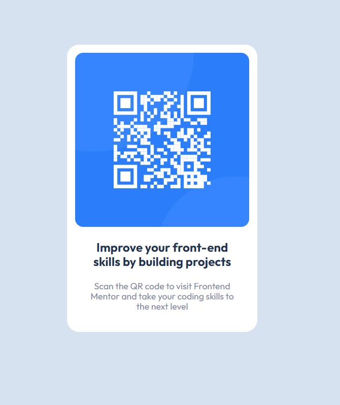

# Frontend Mentor - QR code component solution

This is a solution to the [QR code component challenge on Frontend Mentor](https://www.frontendmentor.io/challenges/qr-code-component-iux_sIO_H). Frontend Mentor challenges help you improve your coding skills by building realistic projects.

## Table of contents

- [Overview](#overview)
  - [Screenshot](#screenshot)
  - [Links](#links)
- [My process](#my-process)
  - [Built with](#built-with)
  - [What I learned](#what-i-learned)
  - [Continued development](#continued-development)
- [Author](#author)
- [Acknowledgments](#acknowledgments)

## Overview

very simple html/css card with a QR code.

### Screenshot

### Links

- Solution URL: [(you are here)](https://github.com/MarcusAnglin/Frontend-Mentor_QR-code-component)
- Live Site URL: [live site URL](https://marcusanglin.github.io/Frontend-Mentor_QR-code-component/)

## My process

This challenge was very straight forward, started with the card and filled in everything as shown in the design.

### Built with

- Semantic HTML5 markup
- CSS custom properties
- Flexbox
- Mobile-first workflow

### What I learned

I have a habit of making my solutions unecessarily complex, even for simple assignments like this.

### Continued development

I'd like to slow down and think of most practical solution of whatever problem I'm trying to solve.

## Author

- Website - [Marcus A](https://github.com/MarcusAnglin)
- Frontend Mentor - [@MarcusAnglin](https://www.frontendmentor.io/profile/MarcusAnglin)

## Acknowledgments

Even a simple project like this can be a huge undertaking for someone who's just starting their coding journey or has only coded along to tutorials, but projects like this are a great way to build confidence and experience. I'm grateful to Frontend Mentor for hosting these projects. and [John Smilga](https://www.johnsmilga.com/) for having great tutorial content available for people like me to learn from.
